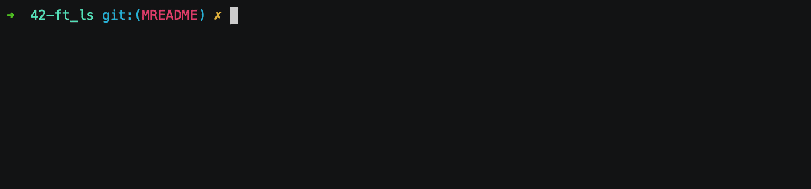

# Ft_ls

First project of the security and systems branch. It's about recoding the `ls` command and some of its options.

## 1. Project Partners

------

- [Marc Jose](https://github.com/mjose-portfolio)

## 2. Install
------

- `make`

### 2.1. Make Options

- `make`: Compiles the files and creates the executable `ft_ls`
- `make clean`: Remove binary files.
- `make fclean`: Deletes the binary files and the `ft_ls` executable file.
- `make re`: Deletes the binary files and the `ft_ls` executable file and recompiles them.

## 3. Options
------
- `-A`: List all entries except for `.` and `..`.
- `-a`: Include directory entries whose names begin with a dot (`.`).
- `-G`: Enable colorized output.
- `-g`: Display the group name in the long (`-l`) format output (the owner name is suppressed).
- `-l`: List in long format. A total sum for all the file sizes is output on a line before the long listing.
- `-o`: List in long format, but omit the group id.
- `-R`: Recursively list subdirectories encountered.
- `-r`: Reverse the order of the sort to get reverse lexicographical order or the oldest entries first.
- `-t`: Sort by time modified (most recently modified first) before sorting the operands by lexicographical order.